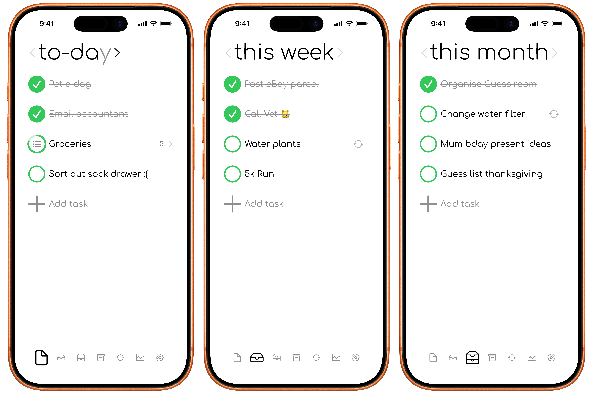
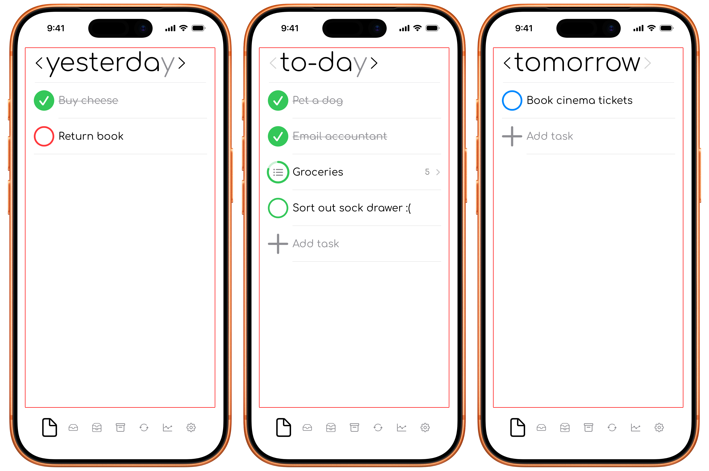
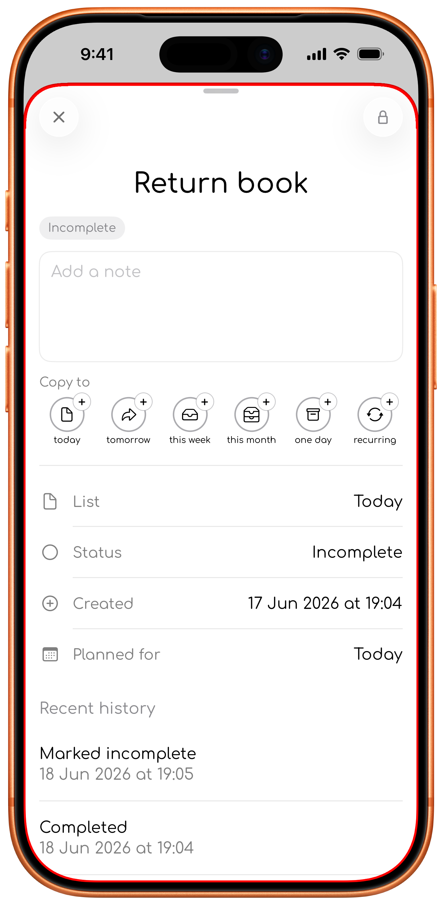
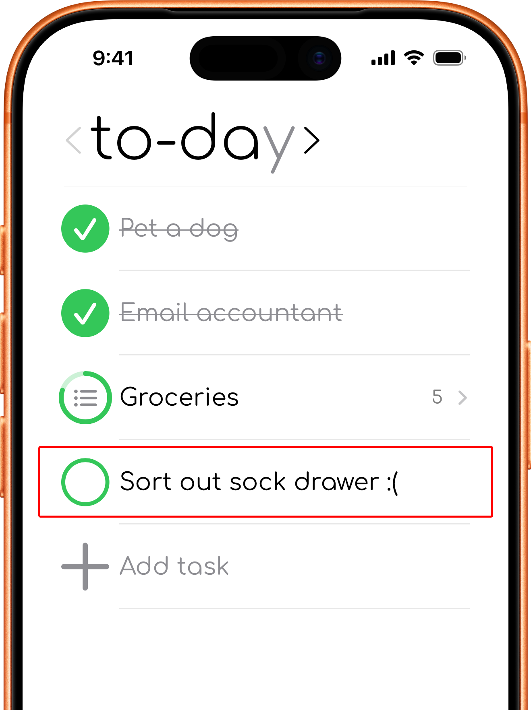
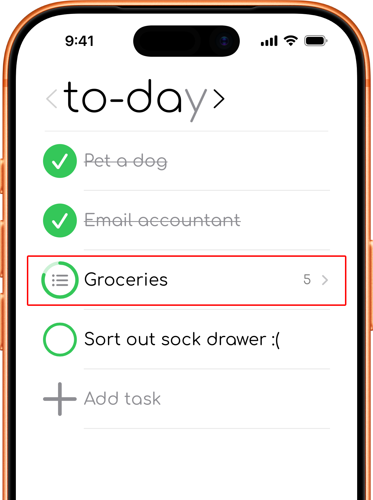
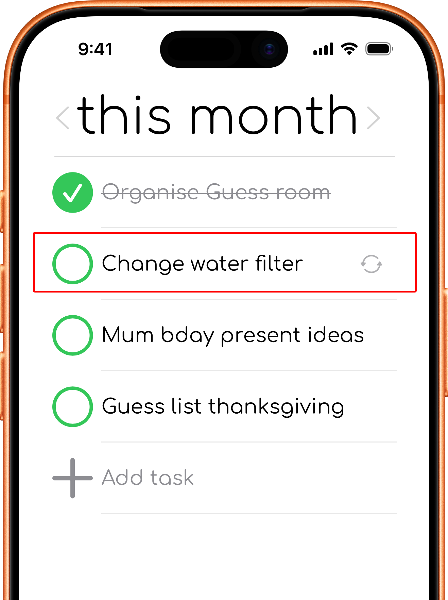
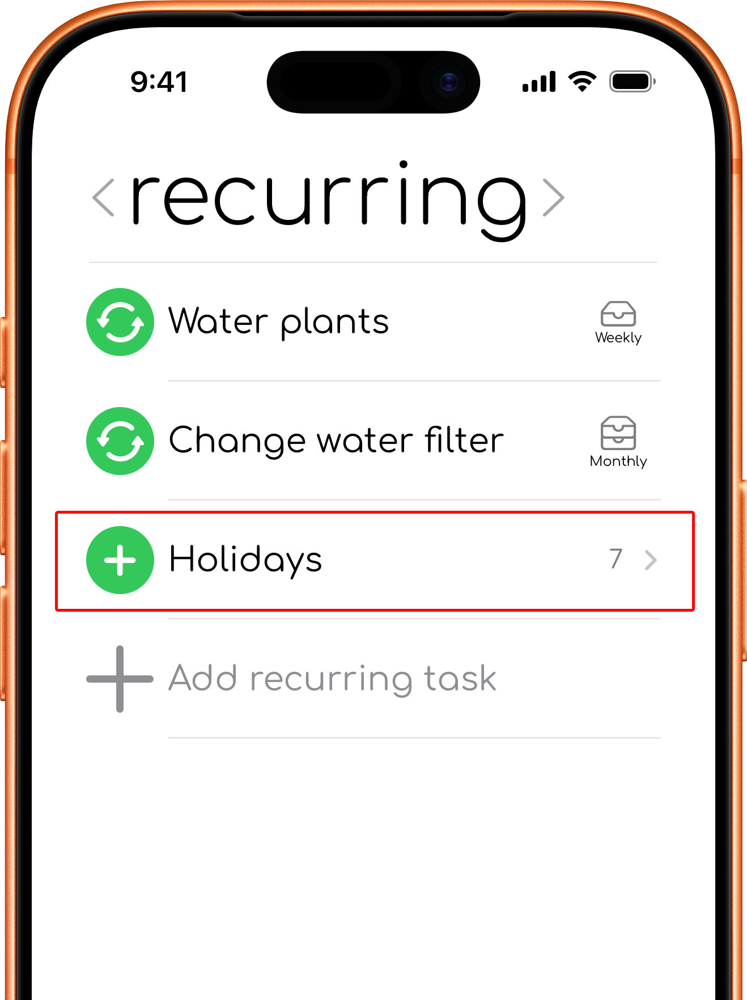
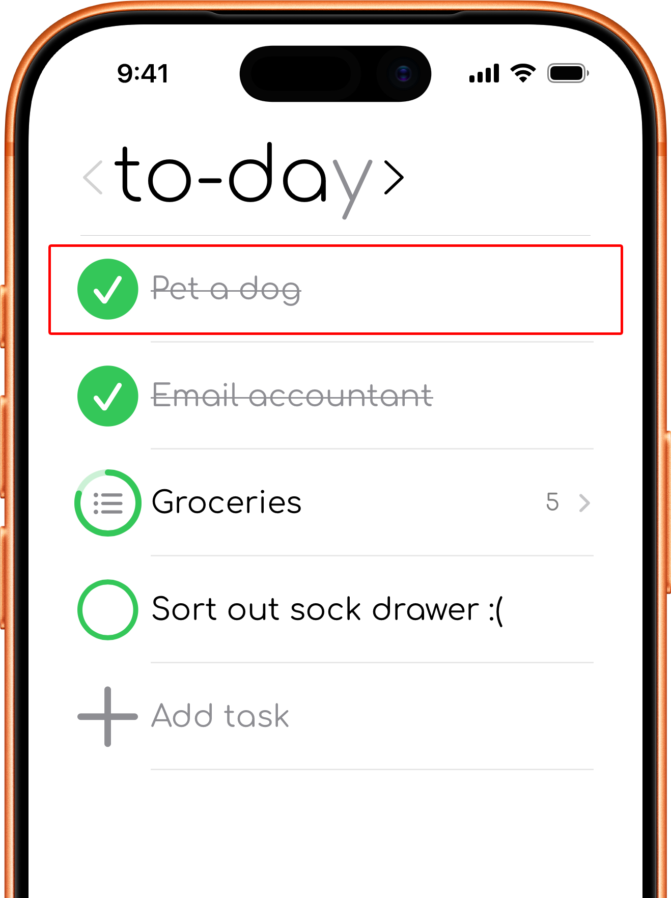
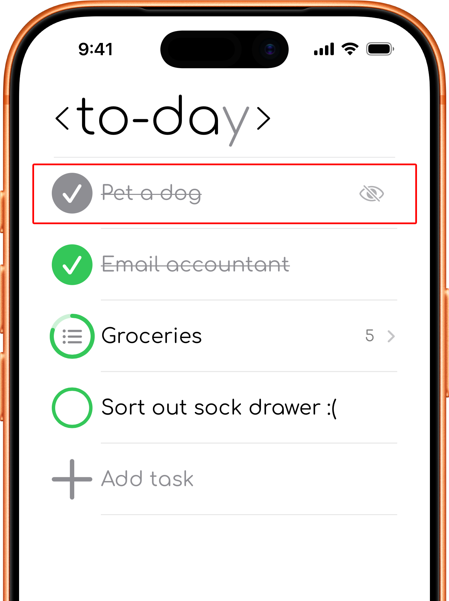
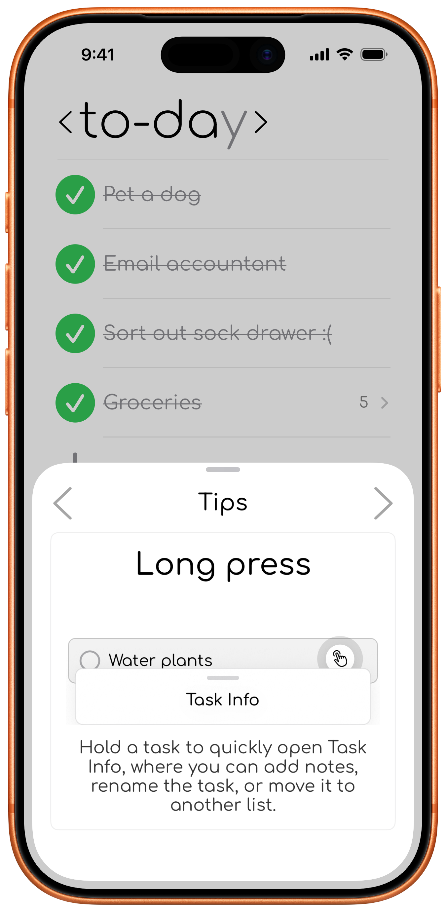

# App Terminology

## App structure

To-day is organised like this:

```text
App
→ Tab
  → View
    → Sheet
```

## Tab
<div >

  

</div>

A main area of the app selected from the bottom menu, such as **to-day**, **this week**, **this month**, **one day**, **recurring**, or **statistics**.

## View
<div >

  
</div>
The current screen or time period shown inside a tab. Examples include Today, Yesterday, 2 days ago, Tomorrow, This Week, Last Week, This Month, and Last Month.

In the **to-day tab**, you can switch between to-day, yesterday, tomorrow, 2 days ago, and earlier-day views.

In the **this week tab**, you can switch between this week, last Week, and earlier-week views.

In the **this month tab**, you can switch between this month, last Month, and earlier-month views.

## Sheet
<div class="phone-shot">

  
</div>
A temporary panel that opens over the current view. Settings, Tips, and Task Info are sheets.

## Task
<div class="phone-shot">

  
</div>
An item you want to remember or complete. A task can include a title and notes, and it belongs to a planning timeframe such as today, this week, this month, or one day.

## Group
<div class="phone-shot">

  
</div>
Two or more tasks with the same **[group tag](Task_Groups.md)** at the start of their titles. To-day displays them together and shows their combined progress.

## Timeframe

When you intend to do a task: **today**, **this week**, **this month**, or **one day**.

## Recurring task
<div class="phone-shot">

  
</div>
A task set to repeat daily, weekly, or monthly. It can be enabled, disabled, archived, or deleted.

## Generated task
<div class="phone-shot">

  
</div>
A normal task created automatically from an enabled recurring task. You can complete, move, or edit it without completing the recurring task itself.

## Someday task
<div class="phone-shot">

  
</div>
A reusable task in the **recurring tab** that does not create tasks automatically.  
Use its add action whenever you want to place a copy in one of your planning tabs.

## Complete
<div class="phone-shot">

  
</div>
Marks a task as done. Completed tasks can be shown or hidden in Settings and can be marked incomplete again.

## Archive
<div class="phone-shot">

  
</div>
Hides a task while keeping it available for later restoration. Archived tasks can be viewed from Trash or shown in lists when the relevant setting is enabled.

## Delete

Moves a task to Trash. Deleted tasks can be restored for 30 days before their identifying content is anonymised.

## Move

Changes the task's timeframe or, within the **to-day tab**, moves it between the Today and Tomorrow views.

## Statistics
<div class="phone-shot">

  
</div>
Summaries and graphs in the **statistics tab**, based on your task history. These include completion rates, completed tasks, timing, and recurring-task streaks.

## Tips
<div class="phone-shot">

  
</div>
Short guides in the Tips sheet that demonstrate useful actions such as swipes, long presses, past views, groups, and Someday presets. Tips can be access using the lightbulb button that shows up now and then or later through the setting tab.
