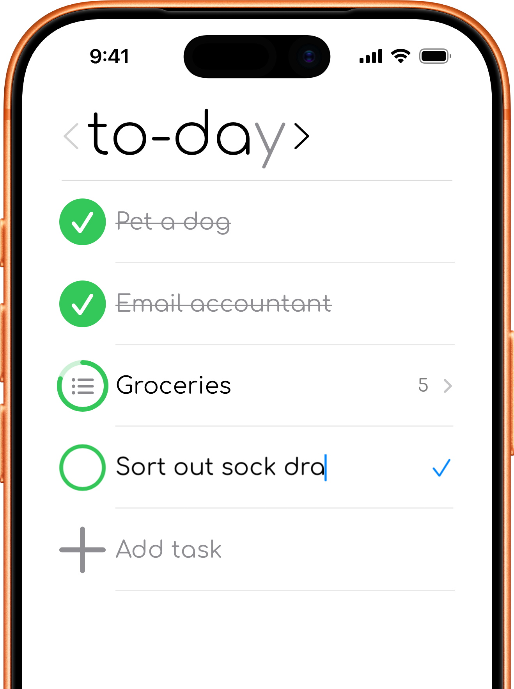
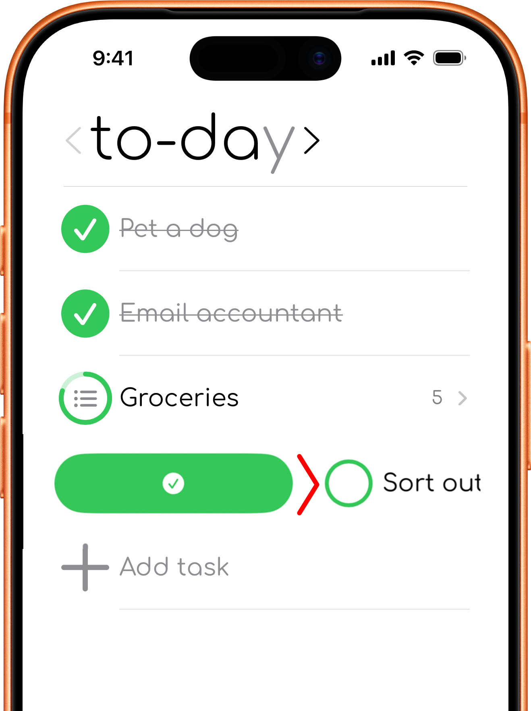
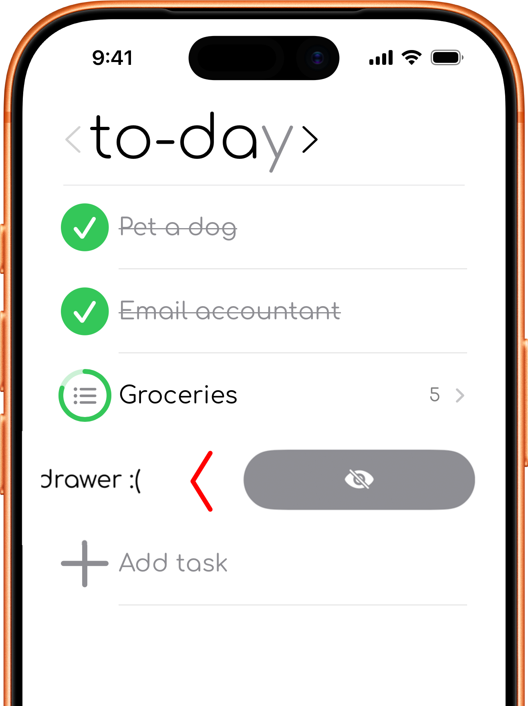
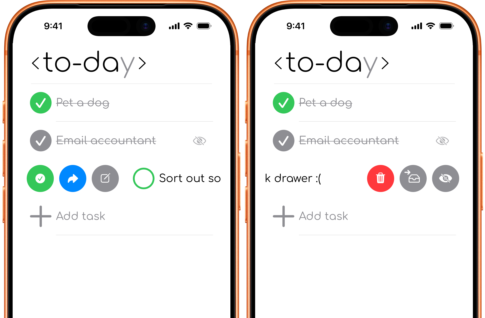

# Gestures

## Tap to edit

Tap a task title to edit it. Finish editing to save the updated title.

  

## Long press for Task Info

Press and hold a task to open the Task Info sheet. From there you can review details, add notes, rename the task, change its planning tab or planned date, and access other available actions.

  

## Swipe right

Swipe a task to the right to reveal actions such as complete or mark incomplete. The available shortcuts depend on the task, tab, and view you are using.

  

## Swipe left

Swipe a task to the left to reveal actions such as archive, move to a later timeframe, or delete.

  

## Half-swipe actions

A partial swipe reveals the available shortcuts without immediately performing a full-swipe action. This is useful when you want to choose a specific move or information action.

Because actions change by tab and view, check the labels before selecting one.

  

