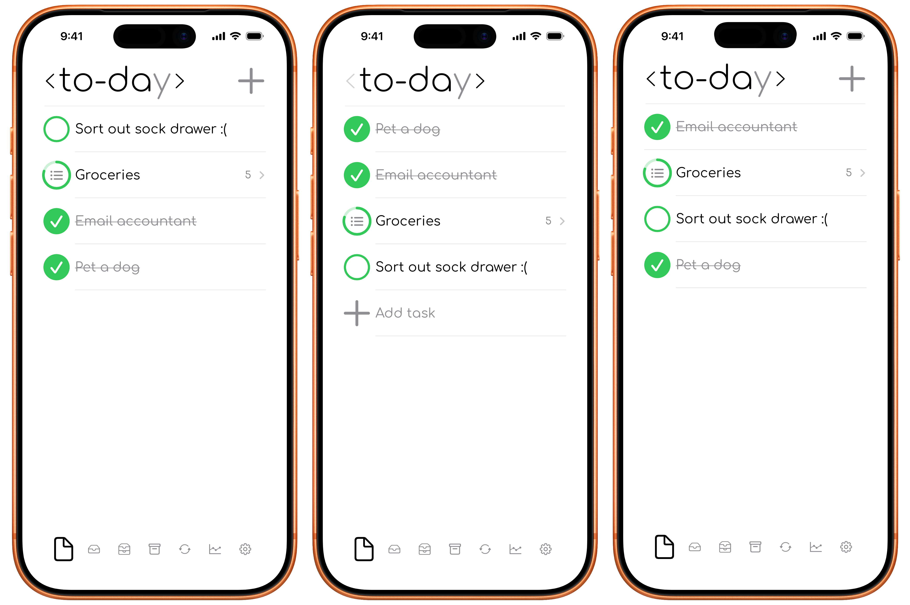

# Settings

Open the Settings sheet to adjust how to-day displays tasks and defines your planning periods.

  

## Layout

Choose how completed and incomplete tasks are arranged, or leave the list unsorted. This also moves the "create task button".

  
  <figcaption>Top | Bottom | Unsorted</figcaption>

## Coloured status circle

The coloured circle shows when if a task was or will be completed in the intended window.

- Green: active in the current view, or completed in its intended timeframe.
- Blue: planned for tomorrow, or completed ahead of time.
- Red: overdue, or completed after its intended timeframe.
- Grey: from a past locked view.
- Soft grey: archived.

You can turn coloured status circles off. When off, active tasks appear grey and completed tasks appear green.

## Day, week, and month boundaries

- **Day starts at** changes when to-day moves from one logical day to the next.
- **Week starts on** selects the first day of your week.
- **Month starts on** selects the day that begins your planning month.

These choices affect which tasks appear in the current and previous time-period views.

## Task visibility

Choose whether to show completed tasks, creation dates, completion dates, and archived tasks.

## Tips and Info

The Tips sheet provides short demonstrations of useful app actions. Info contains details about the app.

## Trash

The Trash view contains archived tasks and recently deleted tasks. You can restore items, move archived tasks into Trash, or permanently remove data using the available confirmed actions.

  

## Storage summary

The Settings sheet shows the number of tasks stored and the size of the local app data. iCloud storage is managed by iCloud and is not shown there.
