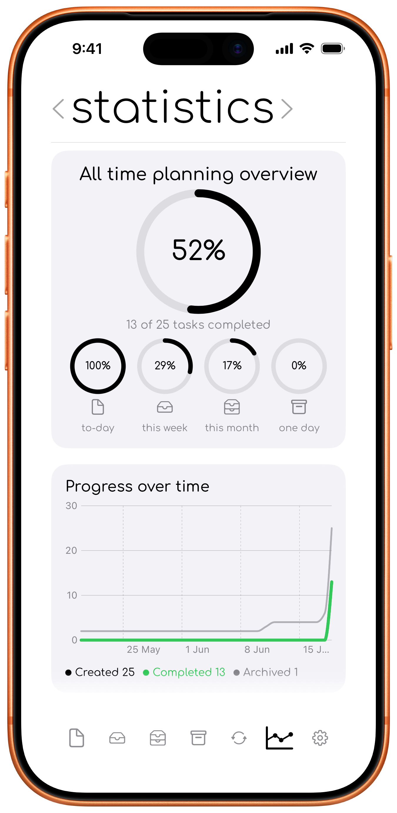

# Statistics

The **statistics tab** gives you an overview of how tasks move from planning to completion.

  

## Completion rates

The all-time overview shows the share of stored tasks you have completed. Smaller rings show completion rates for the **to-day**, **this week**, **this month**, and **one day** tabs.

## Progress and completed tasks

Graphs compare created and completed tasks over time. The completed-per-day section can show This Week, This Month, or This Year, together with a weekly average and best day total.

## Completion time and timing

To-day estimates how long tasks usually remain open and summarises whether completed tasks were finished before, during, or after their planned timeframe.

## Insights

Insights highlight patterns such as how many tasks you complete on active days, how long tasks stay open, and how often tasks move between timeframes.

## Recurring progress and streaks

Recurring statistics can show completion rates, current streaks, and best streaks for enabled daily, weekly, and monthly recurring tasks. Someday presets are counted by how often they create tasks rather than by streak.
