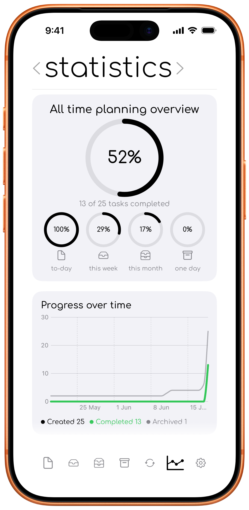

# Statistics

The statistics tab gives you an overview of how tasks move from planning to completion.

  

Statistics should feel helpful, not stressful.

If they are not useful to you, you can hide them from the settings sheet. You will not lose any data, and you can turn them back on whenever you feel like it.

## Completion rates

Use the arrows in Overview to choose All Time, Week, Month, or the available yearly ranges. Smaller rings show completion rates for the to-day, this week, this month, and one day tabs.

The selected range includes tasks created during that period and shows how many of those tasks are now complete. It is different from the completed-tasks graph, which counts tasks by their completion date.

Week and Month follow your planning boundaries in Settings. Year to Date starts on January 1, while Year covers the past year. Yearly options are hidden when they would repeat the same results as another range.

## Progress and completed tasks

Graphs compare created and completed tasks over time. The completed-per-day section can show This Week, This Month, or This Year, together with a weekly average and best day total.

## Completion time and timing

To-day estimates how long tasks usually remain open and summarises whether completed tasks were finished before, during, or after their planned timeframe.

## Insights

Insights highlight patterns such as how many tasks you complete on active days, how long tasks stay open, and how often tasks move between timeframes.

## Recurring progress and streaks

Recurring statistics can show completion rates, current streaks, and best streaks for enabled daily, weekly, and monthly recurring tasks. Historical task data is included in recurring statistics. Someday presets are counted by how often they create tasks rather than by streak.
