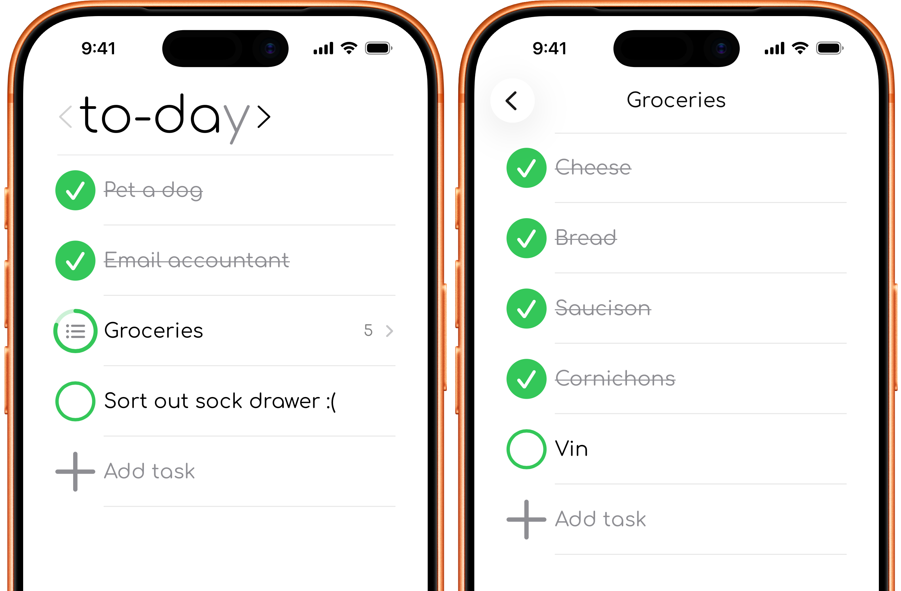
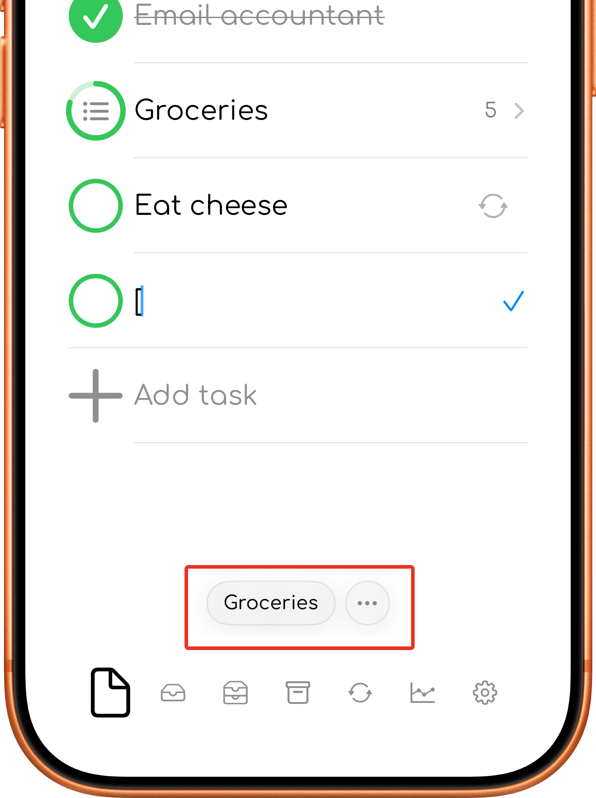
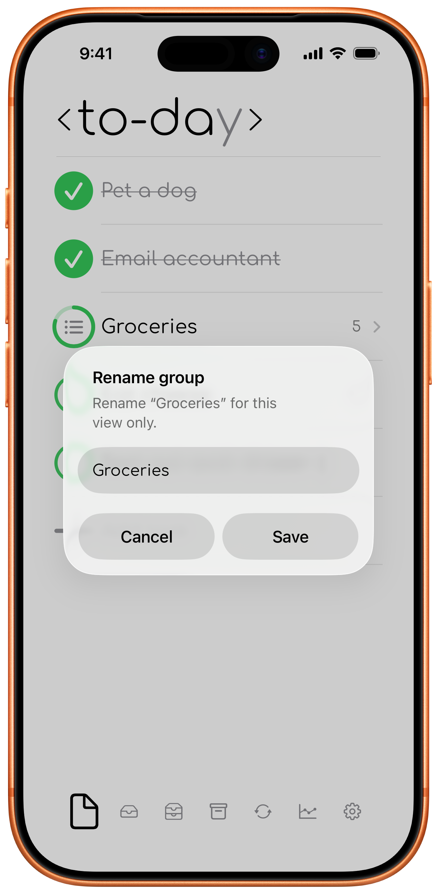

# Task groups

Task groups collect related tasks and show their combined progress.

## Create a group

Add the same group tag at the beginning of at least two task titles. You can use square brackets, curly braces, or colons:

```text
[Home] Buy milk
[Home] Clean kitchen
```

You can also write `{Home}` or `:Home:`. Tasks with matching group names are displayed together.

<div class="phone-shot">

  

</div>
## Group progress

The group row shows how many tasks it contains and visually reflects the completion state of those tasks. Open the group by tapping on it and to see and manage each task.
<div>

  

</div>
## Add a task inside a group

Open the group and use its add-task control. To-day adds the group tag to the new task so it remains inside the group.

## Group suggestions

Start a new task with an existing group tag to add it to that group.

Once you have created at least one group, to-day will suggest matching group tags when you type ` [ `, ` { ` or ` : `.

See [Create a group](#create-a-group).
<div class="phone-shot">

  

</div>
## Rename a group
To rename a group, touch and hold the group title. Enter the new group name and save.

Renaming a group updates the group name used by the tasks inside it, so they stay together under the new name.

This affects only the tasks in the current timeframe.
<div class="phone-shot">

  

</div>
