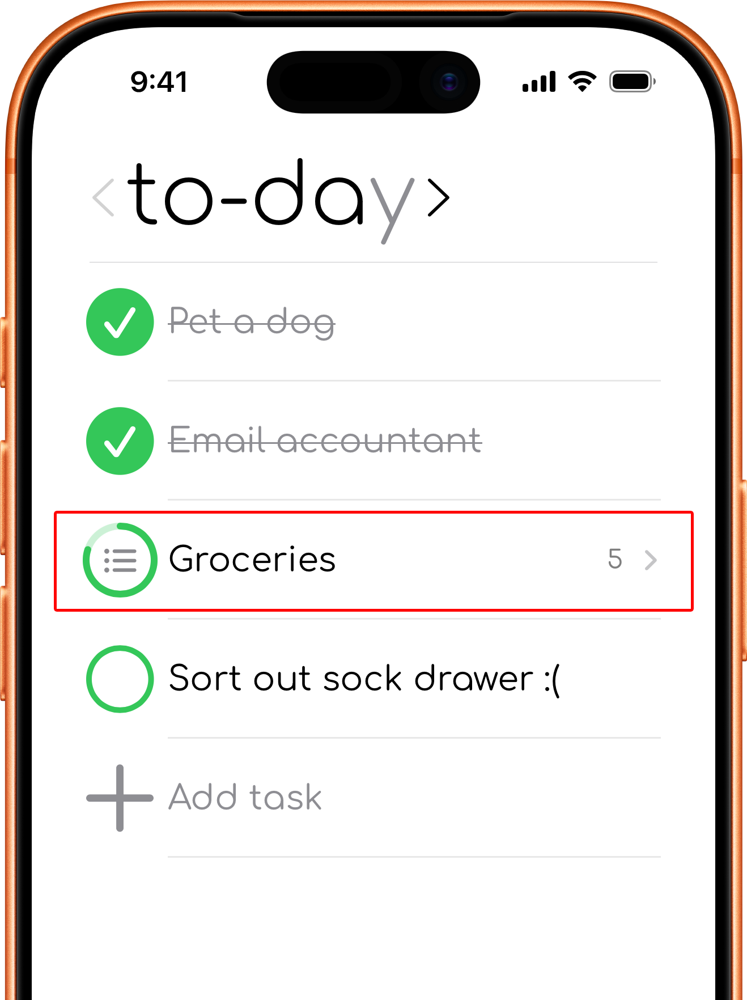
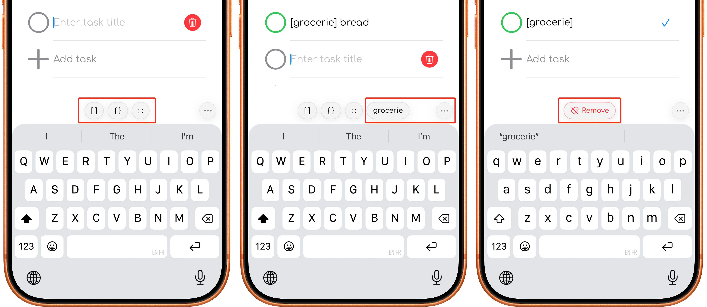
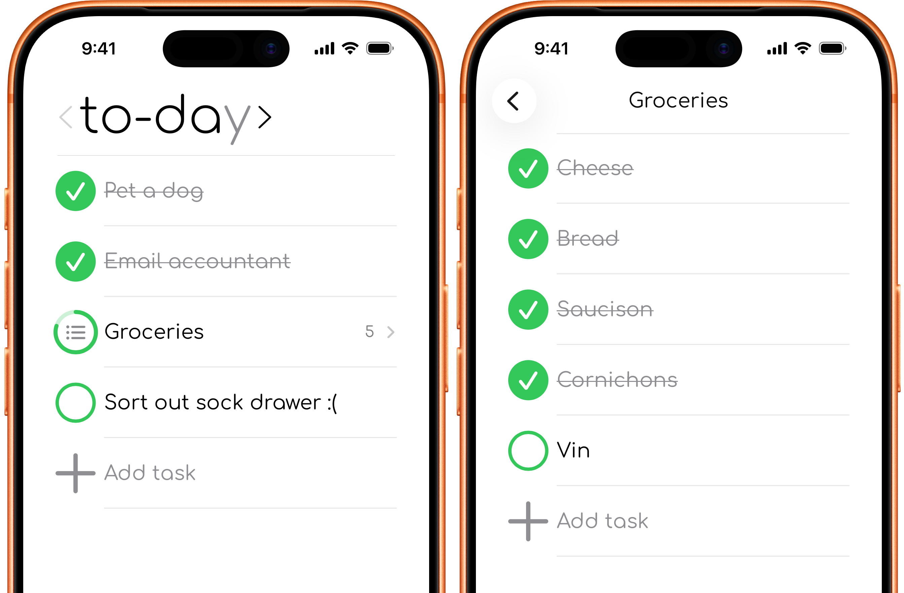
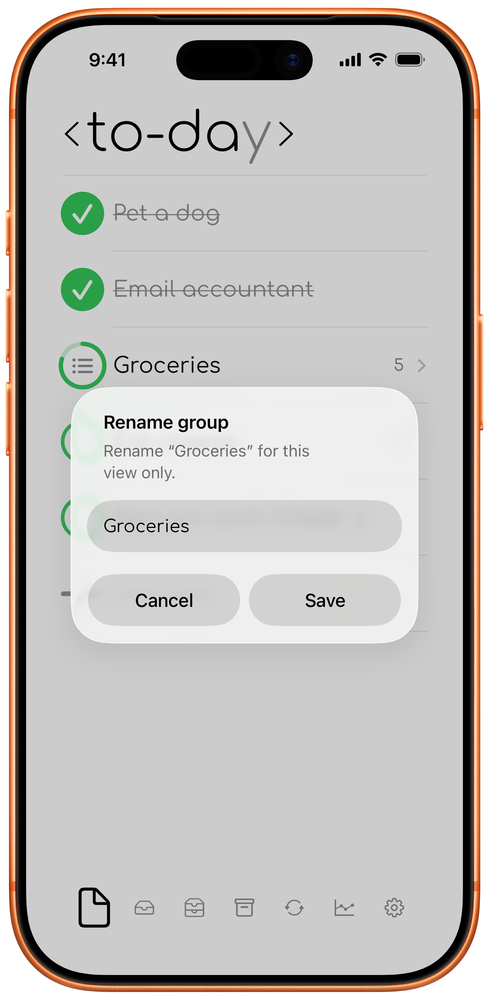

# Task Groups

Task groups collect related tasks and show their combined progress.

## Create a group
Groups are automatically created when a title starts by a group tag.

You can manually add the same group tag at the beginning of at least two task titles. You can use square brackets, curly braces, or colons:

Typing any of the group tag symbols will automatically create the other symbol and move the cursor in the middle of them.
Or simply use the [group suggestions](#group-suggestions).

```text
[Home] Buy milk
[Home] Clean kitchen
```

You can also write `{Home}` or `:Home:`. Tasks with matching group names are displayed together.

<div class="phone-shot">

  

</div>

## Group suggestions

You can quickly add a group by using the group suggestions.

To start, tap the group tag you like and type a group name. Groups in the current view will automatically be suggested. You can also type `...` to see all the groups available in all timeframe.

Group suggestions are available inside groups too. Tapping a new group will move the task to the new group after confirming the new task title.

Group suggestions can be used before or after typing the task title.

<div>

  

</div>


## Group progress

The group row shows how many tasks it contains and visually reflects the completion state of those tasks. Open the group by tapping on it and to see and manage each task.
<div>

  

</div>

## Add a task inside a group

Open the group and use its add-task control. To-day adds the group tag to the new task so it remains inside the group.


## Rename a group
To rename a group, touch and hold the group title. Enter the new group name and save.

Renaming a group updates the group name used by the tasks inside it, so they stay together under the new name.

This affects only the tasks in the current timeframe.
<div class="phone-shot">

  

</div>
