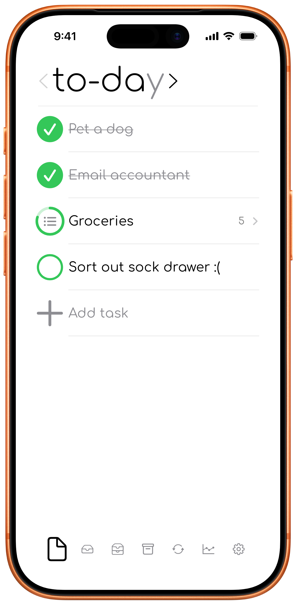
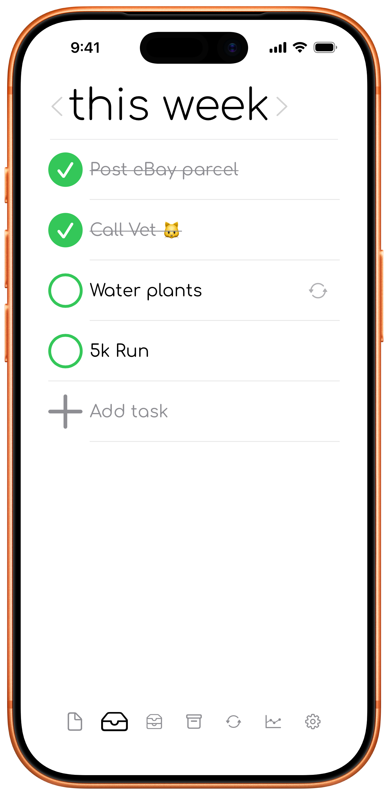
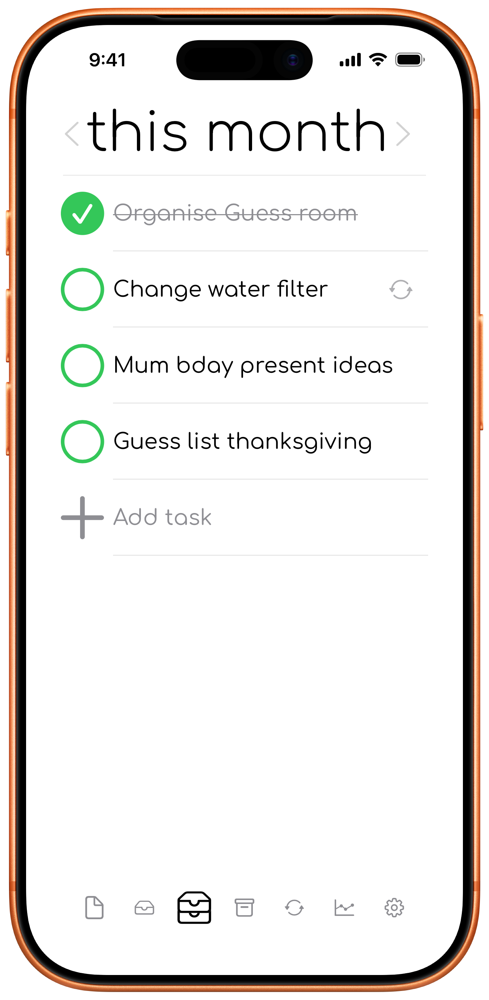
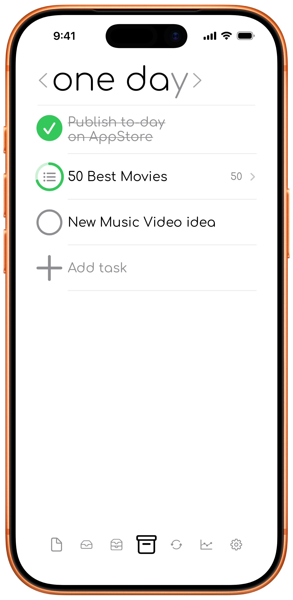
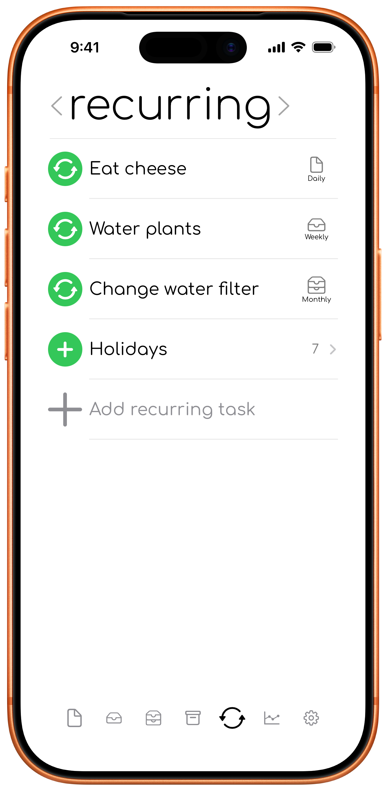
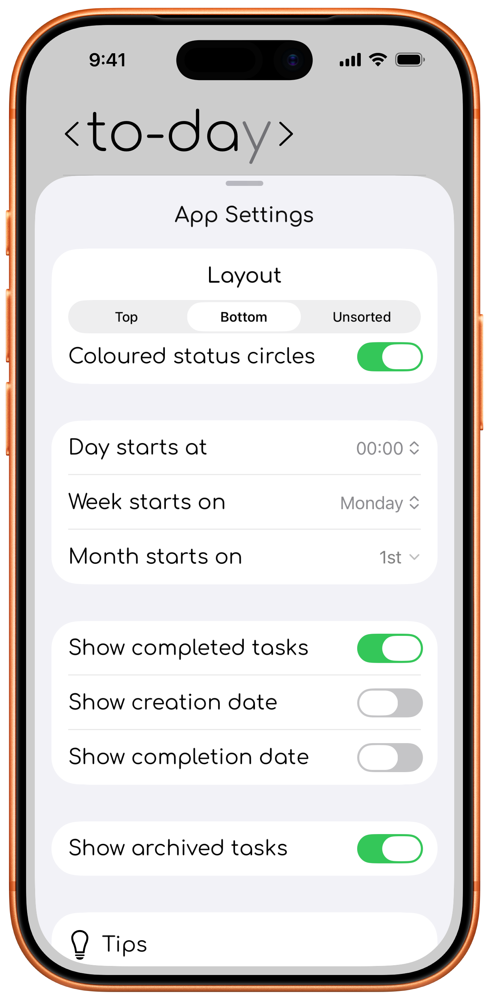
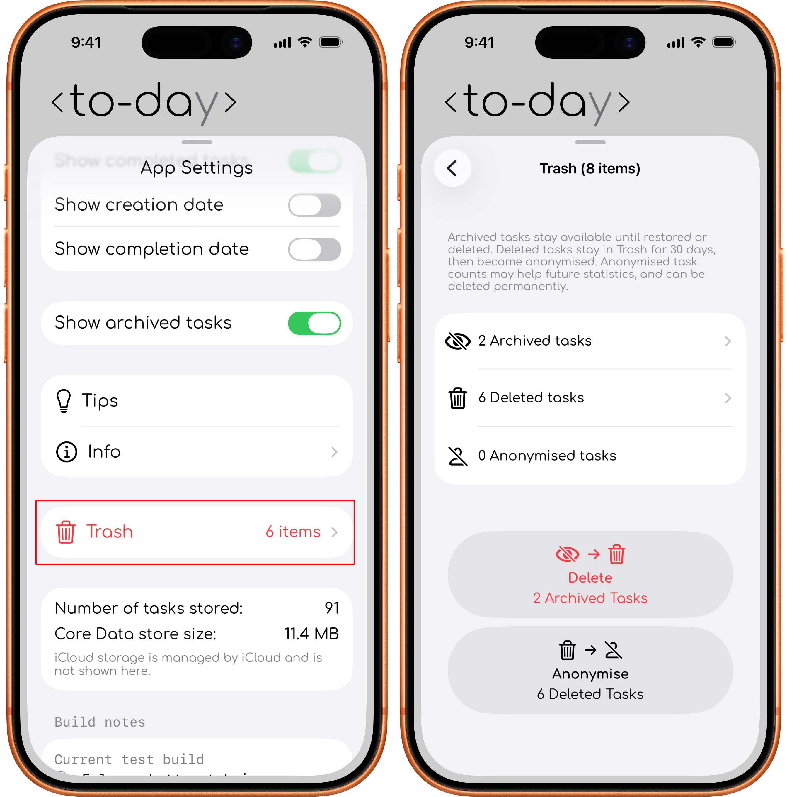

# Tabs & views

## To-day tab

The **to-day tab** contains the Today, past-day, and Tomorrow views. Use the title arrows to switch between them.

  

### To-day view

The to-day view contains tasks planned for the current day.

### Tomorrow view

The tomorrow view lets you plan the next day while keeping those tasks separate from the Today view.

### Past-day views

Use the left title arrow to review Yesterday, 2 days ago, and earlier-day views. Older views may limit actions that would change historical completion information.

## This week tab

The **this week tab** contains the this Week, last Week, and earlier-week views. The This Week view is for tasks you intend to handle during the current week.

  

## This month tab

The **this month tab** contains the this Month, last Month, and earlier-month views. The This Month view is for tasks that matter during the current month but do not yet belong in the Today or This Week views.

  

## One day tab

The **one day tab** is for tasks you want to keep without committing them to the current day, week, or month.

  

## Recurring tab

The **recurring tab** contains repeating tasks and Someday presets. Daily, weekly, and monthly tasks can create tasks in the matching planning tab. Someday presets create a task only when you choose to add one.

  

## Statistics tab

The **statistics tab** shows completion summaries, graphs, timing information, planning insights, and recurring-task progress.

  

## Settings
The Settings sheet controls task layout, date boundaries, visibility options, and access to Tips, app information, storage summaries, and Trash.

  

## Trash view and archived tasks

Open **Settings > Trash** to open the Trash sheet. It contains archived tasks and recently deleted tasks. Archived tasks remain available until restored or deleted. Deleted tasks can be restored for 30 days.

  

