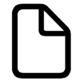
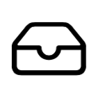
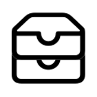
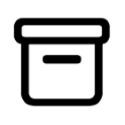
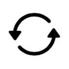
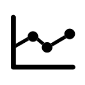
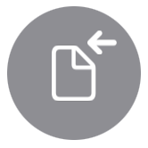
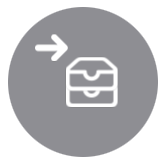
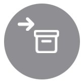
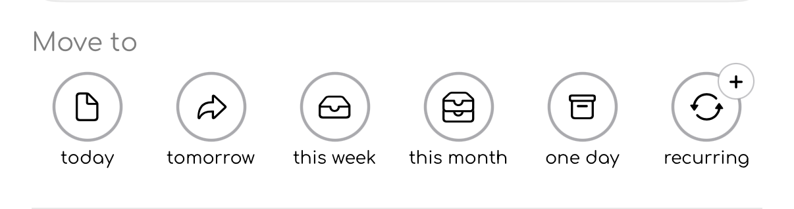

# Icon glossary

This page explains the main icons used in to-day.

The icons below are shown as they appear in the app. Some icons may change colour depending on the task state, selected tab, or whether a task is archived, completed, or being edited.

## Main navigation

These icons appear in the main navigation bar and settings areas.

  

    
    

      <strong>Today</strong>
      
or Daily

      
Your main tasks: the things you want to get done today.

    

  

  

    
    

      <strong>This Week</strong>
      
or Weekly

      
Your first level of planning: the things you want to complete this week.

    

  

  

    
    

      <strong>This Month</strong>
      
or Monthly

      
Your next level of planning: the things you want to do soon, but not yet.

    

  

  

    
    

      <strong>One Day</strong>
      
or Someday

      
Your backlog: the things you will do, but not now.

    

  

  

    
    

      <strong>Recurring</strong>
      
The things you do often, repeated daily, weekly, or monthly.

    

  

  

    
    

      <strong>Statistics</strong>
      
Your completion history, streaks, and progress information.

    

  

  

    
    

      <strong>Settings</strong>
      
App settings and preferences.

    

  

## Task actions

These icons appear on task rows, swipe actions, task information screens, and edit controls.

  

    
    

      <strong>Complete</strong>
      
Marks a task as done.

    

  

  

    
    

      <strong>Complete</strong>
      
Marks a task as not done.

    

  

  

    
    

      <strong>Archive</strong>
      
Hides a task without deleting it. Archived tasks can be shown again later.

    

  

  

    
    

      <strong>Unarchive</strong>
      
Restores an archived task.

    

  

  

    
    

      <strong>Delete</strong>
      
Deletes the task.

    

  

  

    
    

      <strong>Task info</strong>
      
Opens the task information sheet.

    

  

  

    
    

      <strong>Task info — edit mode</strong>
      
Shows that the task information sheet is currently editable.

    

  

---

## Moving tasks

These icons are used when moving a task from one view to another.

  

    
    

      <strong>Move to to-day</strong>
      
Moves the task to the to-day view.

    

  

  

    
    

      <strong>Move to Tomorrow</strong>
      
Moves the task to tomorrow.

    

  

  

    
    

      <strong>Move to This Week</strong>
      
Moves the task to the current week.

    

  

  

    
    

      <strong>Move to This Month</strong>
      
Moves the task to the current month.

    

  

  

    
    

      <strong>Move to One Day</strong>
      
Moves the task to One Day, for things you want to do later.

    

  

---

## Copying and moving tasks

Some task actions use the same destination icons, but the small `+` badge changes the meaning.

  

**Copy to** creates another version of the task in the selected destination.  
The original task stays where it is.

Use **Copy to** when you want the same task to exist in more than one place, for example copying a task from One Day into to-day while keeping it in your backlog.

  

**Move to** sends the task to the selected destination.  
The task is removed from its current view and appears in the new one.

Use **Move to** when the task belongs somewhere else, for example moving a task from This Month to This Week when you are ready to plan it.

## Icon colour meanings

Some icons use colour to communicate state.

| Colour | Meaning |
|---|---|
| Green | Active, current, or completed |
| Blue | Planned for tomorrow |
| Red | Overdue or destructive action |
| Grey | Inactive, past, disabled, or archived |
